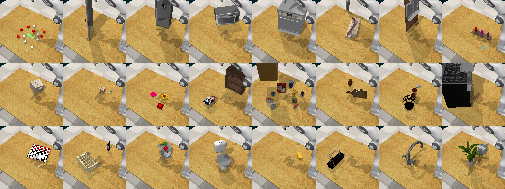

# RLBench: Robot Learning Benchmark [](https://travis-ci.com/stepjam/RLBench) [](https://discord.gg/DXPCjmd)




**RLBench** is an ambitious large-scale benchmark and learning environment 
designed to facilitate research in a number of vision-guided manipulation
research areas, including: reinforcement learning, imitation learning,
multi-task learning, geometric computer vision, and in particular, 
few-shot learning. [Click here for website and paper.](https://sites.google.com/corp/view/rlbench)

**Contents:**
- [Announcements](#announcements)
- [Install](#install)
- [Getting Started](#getting-started)
    - [Few-Shot Learning and Meta Learning](#few-shot-learning-and-meta-learning)
    - [Reinforcement Learning](#reinforcement-learning)
    - [Sim-to-Real](#sim-to-real)
    - [Imitation Learning](#imitation-learning)
    - [Multi-Task Learning](#multi-task-learning)
    - [RLBench Gym](#rlbench-gym)
    - [Swapping Arms](#swapping-arms)
- [Tasks](#tasks)
- [Task Building](#task-building)
- [Gotchas!](#gotchas)
- [Contributing](#contributing)
- [Acknowledgements](#acknowledgements)
- [Citation](#citation)

## Announcements

### 1 April, 2020

- We added a Discord channel to allow the RLBench community to help one another. Click the Discord badge above.

### 28 January, 2020

- RLBench has been accepted to RA-L with presentation at ICRA!
- Ability to easily swap out arms added. [See here](#swapping-arms).

### 17 December, 2019

- Gym is now supported!

### 26 September, 2019
- Given the scope of this project, we expect there to be a number of issues over
the coming months. Please be patient during this time. 
After the initial few weeks of release, we will tag a commit as _'V1'_, which 
should then be used for benchmarking algorithms going forward. Once there are enough 
significant changes in the future, we will tag a new _'V2'_ commit, 
and so on. Versioning like this will ensure results remain consistent and 
reproducible as the benchmark grows.
- Currently, only **live demos** are available when requesting demos. Stored 
demos will be made available soon!


## Install

RLBench is built around PyRep and V-REP. First head to the 
[PyRep github](https://github.com/stepjam/PyRep) page and install.

**If you previously had PyRep installed, you will need to update your installation!**

Hopefully you have now installed PyRep and have run one of the PyRep examples.
Now lets install RLBench:

```bash
pip3 install -r requirements.txt
python3 setup.py install --user
```

And that's it!

## Getting Started

The benchmark places particular emphasis on few-shot learning and meta learning 
due to breadth of tasks available, though it can be used in numerous ways. Before using RLBench, 
checkout the [Gotchas](#gotchas) section.

### Few-Shot Learning and Meta Learning

We have created splits of tasks called 'Task Sets', which consist of a 
collection of X training tasks and 5 tests tasks. Here X can be 10, 25, 50, or 95.
For example, to work on the task set with 10 training tasks, we import `FS10_V1`:

```python
from rlbench.environment import Environment
from rlbench.action_modes import ActionMode, ArmActionMode
from rlbench.tasks import FS10_V1
import numpy as np

action_mode = ActionMode(ArmActionMode.ABS_JOINT_VELOCITY)
env = Environment(action_mode)
env.launch()

train_tasks = FS10_V1['train']
test_tasks = FS10_V1['test']
task_to_train = np.random.choice(train_tasks, 1)[0]
task = env.get_task(task_to_train)
task.sample_variation()  # random variation
descriptions, obs = task.reset()
obs, reward, terminate = task.step(np.random.normal(size=env.action_size))
```

A full example can be seen in [examples/few_shot_rl.py](examples/few_shot_rl.py).

### Reinforcement Learning

```python
from rlbench.environment import Environment
from rlbench.action_modes import ActionMode, ArmActionMode
from rlbench.tasks import ReachTarget
import numpy as np

action_mode = ActionMode(ArmActionMode.ABS_JOINT_VELOCITY)
env = Environment(action_mode)
env.launch()

task = env.get_task(ReachTarget)
descriptions, obs = task.reset()
obs, reward, terminate = task.step(np.random.normal(size=env.action_size))
```

A full example can be seen in [examples/single_task_rl.py](examples/single_task_rl.py).
If you would like to bootstrap from demonstrations, then take a look at [examples/single_task_rl_with_demos.py](examples/single_task_rl_with_demos.py).


### Sim-to-Real

```python
from rlbench import DomainRandomizationEnvironment
from rlbench import RandomizeEvery
from rlbench import VisualRandomizationConfig
from rlbench.action_modes import ActionMode, ArmActionMode
from rlbench.tasks import OpenDoor
import numpy as np

# We will borrow some from the tests dir
rand_config = VisualRandomizationConfig(
    image_directory='../tests/unit/assets/textures')

action_mode = ActionMode(ArmActionMode.ABS_JOINT_VELOCITY)
env = DomainRandomizationEnvironment(
    action_mode, randomize_every=RandomizeEvery.EPISODE, 
    frequency=1, visual_randomization_config=rand_config)

env.launch()

task = env.get_task(OpenDoor)
descriptions, obs = task.reset()
obs, reward, terminate = task.step(np.random.normal(size=env.action_size))
```

A full example can be seen in [examples/single_task_rl_domain_randomization.py](examples/single_task_rl_domain_randomization.py).

### Imitation Learning

```python
from rlbench.environment import Environment
from rlbench.action_modes import ArmActionMode, ActionMode
from rlbench.tasks import ReachTarget
import numpy as np

# To use 'saved' demos, set the path below
DATASET = 'PATH/TO/YOUR/DATASET'

action_mode = ActionMode(ArmActionMode.ABS_JOINT_VELOCITY)
env = Environment(action_mode, DATASET)
env.launch()

task = env.get_task(ReachTarget)

demos = task.get_demos(2)  # -> List[List[Observation]]
demos = np.array(demos).flatten()

batch = np.random.choice(demos, replace=False)
batch_images = [obs.left_shoulder_rgb for obs in batch]
predicted_actions = predict_action(batch_images)
ground_truth_actions = [obs.joint_velocities for obs in batch]
loss = behaviour_cloning_loss(ground_truth_actions, predicted_actions)

```

A full example can be seen in [examples/imitation_learning.py](examples/imitation_learning.py).

### Multi-Task Learning

We have created splits of tasks called 'Task Sets', which consist of a 
collection of X training tasks. Here X can be 15, 30, 55, or 100.
For example, to work on the task set with 15 training tasks, we import `MT15_V1`:

```python
from rlbench.environment import Environment
from rlbench.action_modes import ActionMode, ArmActionMode
from rlbench.tasks import MT15_V1
import numpy as np

action_mode = ActionMode(ArmActionMode.ABS_JOINT_VELOCITY)
env = Environment(action_mode)
env.launch()

train_tasks = MT15_V1['train']
task_to_train = np.random.choice(train_tasks, 1)[0]
task = env.get_task(task_to_train)
task.sample_variation()  # random variation
descriptions, obs = task.reset()
obs, reward, terminate = task.step(np.random.normal(size=env.action_size))
```

A full example can be seen in [examples/multi_task_learning.py](examples/multi_task_learning.py).

### RLBench Gym

RLBench is __Gym__ compatible! Ensure you have gym installed (`pip3 install gym`).

Simply select your task of interest from [rlbench/tasks/](rlbench/tasks/), and
then load the task by using the task name (e.g. 'reach_target') followed by
the observation mode: 'state' or 'vision'.

```python
import gym
import rlbench.gym

env = gym.make('reach_target-state-v0')
# Alternatively, for vision:
# env = gym.make('reach_target-vision-v0')

training_steps = 120
episode_length = 40
for i in range(training_steps):
    if i % episode_length == 0:
        print('Reset Episode')
        obs = env.reset()
    obs, reward, terminate, _ = env.step(env.action_space.sample())
    env.render()  # Note: rendering increases step time.

print('Done')
env.close()
```

A full example can be seen in [examples/rlbench_gym.py](examples/rlbench_gym.py).

### Swapping Arms

The default Franka Panda Arm _can_ be swapped out for another. This can be
useful for those who have custom tasks or want to perform sim-to-real 
experiments on the tasks. However, if you swap out the arm, then we can't 
guarantee that the task will be solvable.
For example, the Mico arm has a very small workspace in comparison to the
Franka.

**For benchmarking, the arm should remain as the Franka Panda.**

Currently supported arms:

- Franka Panda arm with Franka gripper `(franka)`
- Mico arm with Mico gripper `(mico)`
- Jaco arm with 3-finger Jaco gripper `(jaco)`
- Sawyer arm with Baxter gripper `(sawyer)`

You can then swap out the arm using `robot_configuration`:

```python
env = Environment(action_mode=action_mode, robot_configuration='jaco')
```

A full example (using the Jaco) can be seen in [examples/swap_arm.py](examples/swap_arm.py).

_Don't see the arm that you want to use?_ Your first step is to make sure it is
in PyRep, and if not, then you can follow the instructions for importing new
arm on the PyRep GitHub page. After that, feel free to open an issue and 
we can being it in to RLBench for you.

## Tasks

To see a full list of all tasks, [see here](rlbench/tasks).

To see gifs of each of the tasks, [see here](https://drive.google.com/drive/folders/1TqbulbbCEqVBd6SBHatphFlUK2JQLkYu?usp=sharing).

## Task Building

The task building tool is the interface for users who wish to create new tasks 
to be added to the RLBench task repository. Each task has 2 associated files: 
a V-REP model file (_.ttm_), which holds all of the scene information and demo 
waypoints, and a python (_.py_) file, which is responsible for wiring the 
scene objects to the RLBench backend, applying variations, defining success
criteria, and adding other more complex task behaviours.

Here are some in-depth tutorials:
- [Simple Task](tutorials/simple_task.md)
- [Complex Task](tutorials/complex_task.md)

## Gotchas!

- **Using low-dimensional task observations (rather than images):** RLBench was designed to be challenging, putting emphasis on vision rather than 
toy-based low dimensional inputs. Although each task does supply a low-dimensional
output this should be used with extreme caution!
    - Why? Imagine you are training a reinforcement learning agent to pick up a block; halfway through
    training, the block slips from the gripper and falls of the table. These low-dimensional values
    will now be out of distribution. I.e. RLBench does not safeguard against objects going out of the 
    workspace. This issue does not arise when using image-based observations. 
    
- **Using non-standard image size:** RLBench by default uses image observation sizes of 128x128.
When using an alternative size, be aware that you may need to collect your saved demonstrations again.
    - Why? If we instead specify a 64x64 image observation size to the `ObservationConfig` then the
    scene cameras will now render to that size. However, the saved demos on disk will now be **resized**
    to be 64x64.
    This resizing will of course mean that small artifacts may be present in stored demos
    that may not be present in the 'live' observations from the scene. Instead, prefer to re-collect demos
    using the image observation sized you plan to use in the 'live' environment.
    

## Contributing

New tasks using our task building tool, in addition to bug fixes, are very 
welcome! When building your task, please ensure that you run the task validator
in the task building tool.

A full contribution guide is coming soon!

## Acknowledgements

Models were supplied from turbosquid.com, cgtrader.com, free3d.com, 
thingiverse.com, and cadnav.com.

## Citation

```
@article{james2019rlbench,
  title={RLBench: The Robot Learning Benchmark \& Learning Environment},
  author={James, Stephen and Ma, Zicong and Rovick Arrojo, David and Davison, Andrew J.},
  journal={IEEE Robotics and Automation Letters},
  year={2020}
}
```
