# Complex Task Walkthrough

Here we will walk through the entire process of building a more complex task, empty_container. Hopefully you will have something that looks like the following by the end:


This tutorial will assume some of the knowledge learnt in the Simple Task Walkthrough, so make sure to work through that first. As for every task built, we will again go through each of the stages: (1) creating the task through the task builder, then (2) creating the task by adding objects to the scene in a V-Rep simulator instance, (3) coding the Python File, then finally (4) passing the Task Validator.

In addition to the features common to all tasks, this task will need to excute the following:
* **Dynamically Sample and Spawn Procedural Objects** - These are a collection of various small shapes as models downloaded as .obj and .mtl files from  https://sites.google.com/site/brainrobotdata/home/models. If you wish to understand how these object files fit into the repository, examine the rlbench/assets/procedural_objects directory which at minimum must contain the {*object_name*} and {*object_name*}*\_coll* files for every object.
* **Setting target container colors** - The target containers will cycle through the colors list found in *rlbench/backend/const.py* with every change in variation.
* **Grasping** - Many tasks require the Panda to grasp and pick objects up. We will see how waypoints can be given extension strings to control this functionality.
* **Dynamically Repeat Waypoints** - For every object to be removed from the large container, the same set of waypoints will be used, with the Panda's path being re-calculated for every remaining object to be moved. The only difference between these paths will be the position of the grasping dummy *waypoint1*, so we will need to define a function which re-positions this dummy to another object with every repetition.
* **Account for Failed Grasps** - Many of the procedural objects are awkwardly shaped and thus difficult to grasp. When the Panda fails to grasp an item at *waypoint1*, it will still complete its path (if reachable) with nothing grasped. In order to raise the percentage of succesful demos and thus pass the task validator, we would like to account for this. This will be done by assessing which objects have been succesfully moved at every time step in the *step()* function, and instructing the task to re-position and repeat waypoints until all items have been moved to the target container. 
* **Cleanup Dynamic Objects** - The state of the scene before a demo must match the state of the scene upon demo completion. As such, we will use the *cleanup()* function to remove all of the procedural objects from the V-Rep scene upon completion of every demo.

## A note on Grasping and Physics in V-Rep
It is worth discussing here how the Panda grasps objects in the simulator, and how this differs from how a human hand would grasp in the real world. Rather than rely on friction and reactionary force as a person would when picking something up, RLBench and PyRep simplify physics calculations (and thus speed up and smooth out simulation) by making any object upon which the Panda's gripper closes on a child of the Panda tip, as long as said object has been registered as graspable in the python file. This keeps the object's pose stationary relative to the Panda tip while it is grasped, and the object is released from this relationship when it is returned to its original place in the Scene Hierarchy tree upon the re-opening of the gripper. This can even be noticed in the animation of empty_container above; see the objects labeled 'Shape' followed by a number dissapear from view in the scene hierarchy when grasped (in actual fact they are still there, but are moved to into a node of the Panda's collapsed sub-tree) and re-appear when dropped. 

Note then that what matters for grasping, and for the entire task, is not that every physical property of every object matches exactly what it would be in real life, but that succesfully completed demos behave in such a way that a model could theoretically learn how some of these common items would behave in common tasks. In practice it is okay for a small item that might have a mass of 0.1kg in real life to have its mass set to 0.5 or 5kg in the simulation, as long as the task environment is reflective of the actions and interactions that would be happening in real life. Some objects, like the hanger in the *move_hanger* task, will have a certain 'visual' object as a child of a similar, more simple 'physical' object that is set to invisible (by inverting its camera visibility layers - more on this later) in order to speed up the task. This is done because having every object in a simulation be either a simple, convex shape or a grouping of such massively simplifies the calculations performed by the physics engine, helping to eradicate buggy and unrealistic behaviours which you may otherwise encounter.

Workarounds are sometimes useful, and do not necessarily impact the quality of the task and its contribution to the data set. For example, when creating the peppers in weighing_scales, it was found that they would naturally slide towards one direction when left alone on a flat surface, as if that surface was somehow tilted. Adding an 'invisible' block to the base of the peppers increased their surface area and stopped this from happening without affecting the quality of either (a) the visual information available to the panda throughout the task or (b) the actions the Panda would take to succesfully complete it. You will likely encounter unrealistic and frustrating behaviors of objects in the physics simulator at some point - look at existing tasks to inspire creative workarounds that maintain the high quality of this dataset.

## 1 Creating the Scene in V-Rep
## Creating the Large Container
First we will create the large container by creating 5 seperate cuboids, one for each plane of the container, then grouping these cuboids such that they can be treated as a single shape in both the V-Rep instance and the Python file. Create a cuboid with by clicking Add -> Primitive shape -> Cuboid and setting its dimensions as follows: 

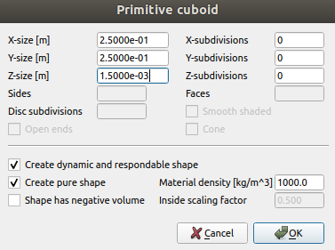

Hit enter/okay and rename this cuboid *large_container0*, make it a child of the *empty_container* dummy in the scene hierarchy, then drag it up to or place it on the table's surface. Now we will change its color to grey by double clicking on its name in the scene hierarchy to open the Scene Object Properties; click on *Adjust color* to open the Shape dialog, then select *Ambient/diffuse component* and adjust the parameters as seen below. Note that as RGB and HSL are simply two parametizations of an item's color, only one of them needs to be set. The other one will adjust itself automatically.

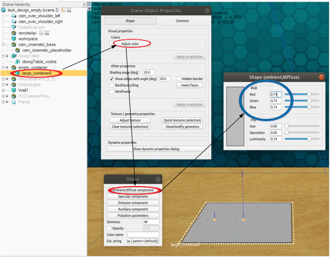

Next we will create the sides of the container. Add another cuboid with dimensions {*3.00e-01*, *6.00e-03*, *1.5e-03*} and open its Rotation/Orientation dialog by selecting the cuboid in the Scene Hierarchy, clicking on the Rotation icon in the upper left hand side of the window, and setting its orientation (relative to the world) as below.


Once you have done that, rename it to *large_container1* and make it a child of *large_container0* in the Scene Hierarchy, then move up to the table top it by opening the mouse translation dialog, selecting mouse translation, ensuring that only the *along z* box is ticked, and dragging it it by holding the left mouse click. Remember that more precise mouse translation can be achieved by holding shift whilst dragging the object once the left mouse button has been held down. Then place it such that its edge is adjacent to the edge of the container base by performing a mouse translation whilst only *along Y* is selected. You should now have a Scene and Scene Hierarchy which looks like the following:

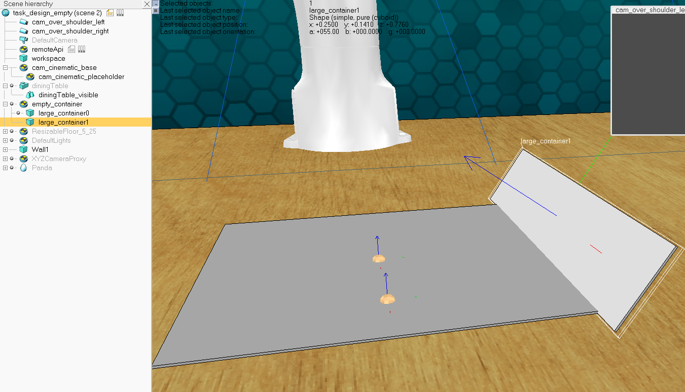

Now we need to create and postion the rest of the large container's walls. Copy and paste the wall by selecting *large_container1* in the Scene Hierarchy and doing Ctrl+C then Ctrl+V, this will create *large_container2* which you must then make a child of the task dummy. Now we will rotate the object by performing a mouse rotation: ensuring *large_container2* is selected, open the rotation dialog, and select *Relative to: World* and *about Z*. Holding down the left mouse click, drag the mouse around until the wall has rotated 90 degrees anti-clockwise like so:

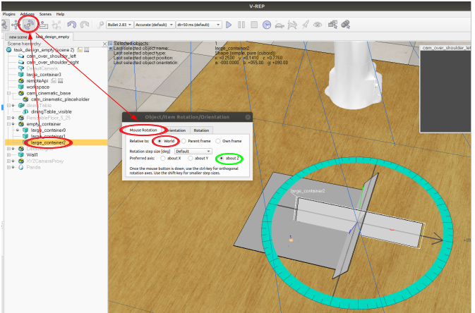

We will now use a trick to place the second wall, which will work so long as *large_container1* has been perfectly centered with  *large_container0* along the Y Axis (ensure this is the case by checking that the position of *large_container1* relative to its parent frame is 0.00 in the X-coord box). We can simply take make *large_container2*'s X-coord relative to its parent frame the negative of *large_container1*'s relative Y-coord position, and then set *large_container2*'s relative Y-coord position to that of *large_container1*'s relative X-coord position like below. Your *large_container1* might not have the exact same relative X and Z co-ordinates and that's perfectly okay, what matters here is that the described relationships hold:

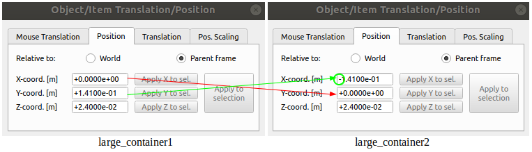

Repeat this process to create and postion the remaining two walls, working out how to position the walls for yourself. This should leave you with the following:

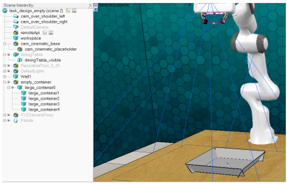

Now we will group each of the large_container objects together in order to end up with a single object which we can manipluate and reference. While holding down the Shift key, select each of the large container objects, ensuring that you click on *large_container0* last (this is done because the created group will be names after the object last clicked on), then right click on the grouping in the Scene Hierarchy. Select Edit->Grouping / Merging->Group selected shapes like so:


Rename the resulting grouped object to *large_container*. Set all 4 of its *Object special properties*, and ensure that it is set to to *Respondabl* but not *Dynamic* by clicking on *Show dynamic properties* under the *Common* tab of the Scene Object Properties dialog.

#### A note on Grouping and Merging
Both grouping and merging allow us to treat a collection of objects as a single object, but there are some key distinctions between the two actions which will affect how we choose which action to use. As previously mentioned, the physics engine runs far faster and smoother when all shapes for which it makes calculations are convex. If a *merge* would result in a non-convex object being created, potential problems arise. Merging does, however, have the advantage of creating a tighter coupling between objects for the purpose of dynamic motion, ie motion that occurs as a result of physical laws like gravity as opposed to motion that is the direct result of scene manipulation, such as if the Panda were to grasp and move an object. This means that any grouping of objects will not preserve the relative poses of the grouped objects. For example, if we had instead created a mug object by grouping a mug body and handle and then attempted to pick up the mug by its handle, it would come detached from the body, as if they were never actually connected. In this case a merging would result in a non-convex shape, so we could instead make the mug body a child of the handle and hope that the body never has a force applied onto it that is not also applied to the handle (the mug body remains stationary relative to the handle when the handle is moved because of parent-child relationship but the reverse relationship would not hold!), or better yet find a way to create the mug as a single convex object (more on this in another document). 

That said, these problems only apply if such objects are made *dynamic*, only then can external forces other than the actions of the Panda and forces resulting from an object collision act on our objects in the V-Rep simulator. All containers to be added in this task will have their dynamic properties turned off, meaning that their pose will stay static unless an object in the scene were to do work on it, which it will not. You will however, need to ensure they are set to *Respondable*. As such, either grouping or merging would work just fine here and only actually serve the purpose of allowing us to treat the container as a single object in both the V-Rep scene and the Python File.

#### Creating the Target Containers
Now that you have learnt how to create and compose container object from simple shapes, it is left up to you to create the two smaller target containers seen in this walthrough's first gif animation, which should be named *small_container0* and *small_container1*. The only differences between the large and target containers are (1) the targets' walls should have their *Alpha* orientation value set to 90 rather than 55 degrees once instantiated, (2) they need to be postioned slightly to either siide of the large container, and (3) they will be slightly smaller. Their absolute size does not matter too much, but they will need to be large enough to hold the collection of procedural objects spawned in the task. Finally, it is recommended that you first create one target container, position it to the side of the target container, then and copy and paste it, making sure to position it exactly on the opposite side of the large_container. The color of these target_containers will be set dynamically in the python file so you do not need to worry about setting it here. Set their *Object special* and *Dynamic* properties. Once you have completed this step, your scene should appear as below:

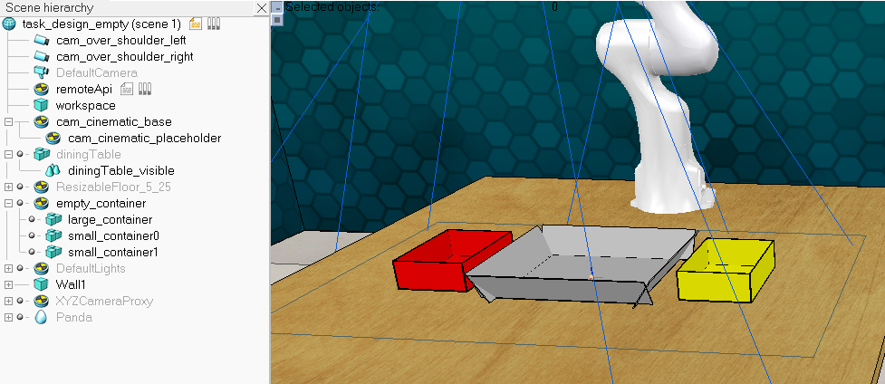

#### Adding Proximity Sensors
We now need to add 2 proximity sensors, and they need to be positioned such that they can detect all objects placed inside the target containers. Add a *Pyramid type* proximity sensor and change its volume parameters (by clicking on *show volume parameters in its Scene Object Properties dialog* such that all X and Y fields are equivalent to the X Y dimensions of your target container's base, and its *Range* set to the height of your target container's walls. Remember to set the *Offset* parameter to 0 like so, and remember also that your volume parameters may differ slightly from the ones shown here because your target container volume will likely not be the exact same as the ones created here:

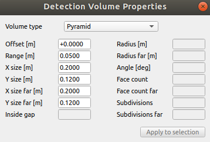

Once you have added this, name it *success0*, make it a child of *small_container0*, and set its position relative to its parent to 0 in all fields. Copy and paste this sensor to create *success1*, and again make it a child of *small_container1*, setting its relative position to 0.

#### Adding Waypoints
The last step we need to do is create waypoint dummies. This task requires 4 waypoints:

* **waypoint0**: the approach waypoint, positioned at the center of *large_container*'s base and roughly 20 cm above it.
* **waypoint1**: the grasping waypoint. This waypoint's position will be set dynamically in the python file every time a new object needs to grasped so its position does not matter too much; here it has been placed halfway between *large_container*'s base and *waypoint0*.
* **waypoint2**: the lifting waypoint. The purpose of this waypoint is to raise objects up to a reasonable height such that the panda can then move objects horizontally without colliding into any of the objects we have created. We will positon this waypoint in the exact same location as *waypoint0*.
* **waypoint3**: the drop waypoint. The panda will release items from its grasp when this waypoint is reached and we will place this waypoint above the center of either *small_container0*. Depending on the variation, the python file will sometimes place this waypoint above *small_container1*. This dummy will have the same height as waypoints 0 and 2.

Begin by adding a dummy and naming it waypoint 0. Set its position as described above (make the dummy a child of *large_container* and set its relative positional vector to {0, 0, 0.17}), and adjust its orientation (relative to the world) as to {180, 0, 180}, naming it *waypoint0*. One thing to be aware of is that sometimes V-Rep will struggle to set a position or orientation to absolute 0, instead setting an arbritratily small value as below:

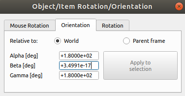

Next, copy and paste this waypoint, lowering its position by any means you wish to use to roughly halfway between *waypoint0* and the table's surface. After this copy and paste *waypoint0* again to create *waypoint3*, and leave it as is. Finally, do one final copy and paste to create *waypoint4*, and in the same way that we set the position of *waypoint0*, position it centrally over *small_container0*. Then if not already so, ensure that these waypoints are all children of large_container. Once you have done this, your scene and scene hierarchy should look like the following:

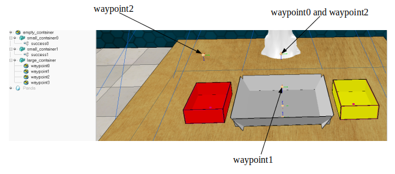

#### Extension Strings
We must assign extension strings to some of the waypoints in order to control grasping and ungrasping. In order to do this, we will need to open the Scene Object Properties dialog for dummies for which we wish to add such strings, select the *Common* tab at the top of the dialog, and typing in the strings ourselves in the *Extension String* text box found under *General properties*. We want to make sure that the gripper is open and ready to grasp once it reaches *waypoint0*, as such set its extension string like so:

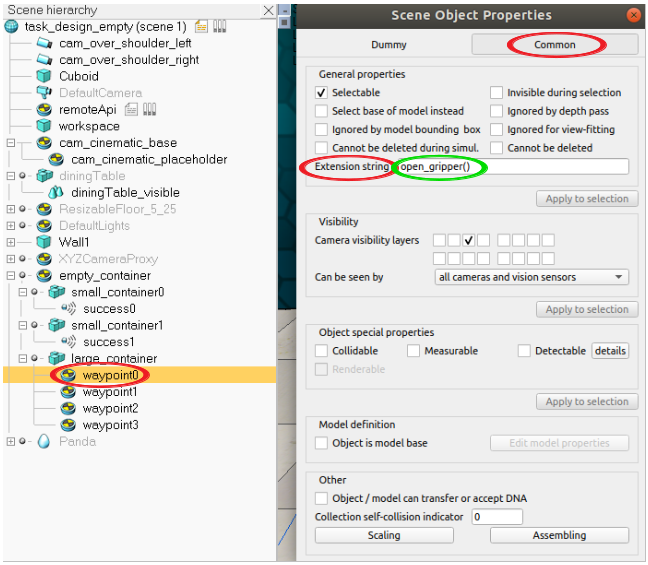

We will set *waypoint1*'s extension string to *close_gripper()* in the same manner described above. Here we will also need to account for two seemingly contradictory factors: (1) some of the procedural objects will be spawned in such a manner where they occlude or are in contact with one another and as such grasping one would require colliding with the other and (2) path planning as we have used it so far only calculates paths if collisions can be avoided. Luckily, an extension string *ignore_collisions* exists which instructs the path planning algorithm to do just that. We can assign multiple extension strings to a single waypoint separated by a comma or semi-colon like so (do this for your *waypoint1*):


Note here that the waypoint succeeding any waypoint with the *close_gripper* extension must have *ignore_collisions* set. As such we will add this to *waypoint2*, and add *open_gripper()* to *waypoint3* in order to instruct the panda to drop items into the small container.

#### Adding the Spawn Boundary
The final step in completing our task model is to add a spawn boundary so that we can instruct the dynamic spawning of procedural objects in the python file like the one below:

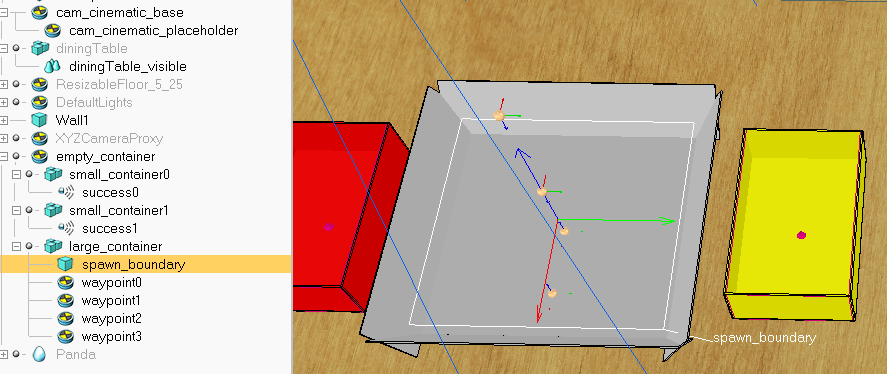

The simplest way to do this is probably by copying and pasting the workspace and aligning its' center with that of the *large_container* by setting it as a child of *large_container* then setting its relative pos to 0. Perform a mouse translation along the z axis such that the plane is vertically positioned roughly halfway between the base and the upper most edge of the container, then renaming it to *spawn_boundary*. Next we will adjust the size of the plane so that it is just a little smaller than the size of *large_container*'s base. Open *spawn_boundary*'s geometry dialog by clicking on *View/Modify geometry* in the *Scene Object Properties* dialog under the *Shape* tab, unchecking *Keep proportions*, and adjusting the X and Y fields under *Bounding box size*. Keeping the Z value constant, use trial and error to set values which make *spawn_boundary* a square plane just smaller than the base of *large_container*. Finally, make *spawn_boundary* a child of large container as shown in the image above.

To finish this step, we will invert *spawn_boundary*'s visiblity layers so that it will not be visually present in the task. In general, this is done by opening the *Scene Object Properties* dialog, opening the *Common* tab, and under *Visibility* unchecking all the boxes in the first row and checking the equivalent boxes in the row just beneath it:

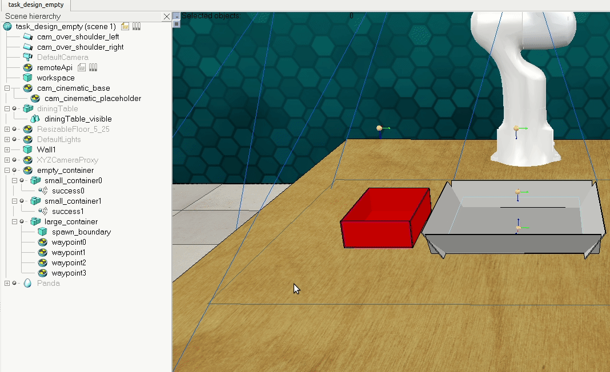

Make sure to save the .ttm by inputting 's' in the task_validator when simulation is not running:

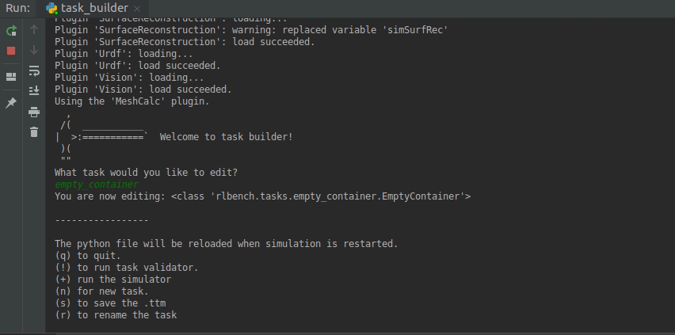

We are now ready to begin coding the Python file.

## 2 Writing the Python File
First we need to ensure that we import the necessary classes like below. In practice, this is normally done as you write the script, but we can do it all in one go for the purposes of this walkthrough:

```python
from typing import List, Tuple
from rlbench.backend.task import Task
from rlbench.const import colors
from rlbench.backend.task_utils import sample_procedural_objects
from rlbench.backend.conditions import ConditionSet, DetectedCondition
from rlbench.backend.spawn_boundary import SpawnBoundary
import numpy as np
from pyrep.objects.shape import Shape
from pyrep.objects.proximity_sensor import ProximitySensor
from pyrep.objects.dummy import Dummy
```

### init_task() -> None:
Here we will first instantiate object handles, remembering that the handle to a spawn boundary shape must later be passed as a list when instantiating a *SpawnBoundary* object.

```python
self.large_container = Shape('large_container')
self.target_container0 = Shape('small_container0')
self.target_container1 = Shape('small_container1')
self.spawn_boundaries = [Shape('spawn_boundary')]
self.success_detector0 = ProximitySensor('success0')
self.success_detector1 = ProximitySensor('success1')
```
We will then call two functions, *register_waypoint_ability_start()* and *register_waypoints_should_repeat()* like so:

```python
self.register_waypoint_ability_start(1, self._move_above_object)
self.register_waypoints_should_repeat(self._repeat)
```

The first of these simply allows us to have the task execute some kind of code or functionality before moving towards this waypoint, in this case we will be defining *_move_above_next_object* which will move *waypoint1* (the grasping waypoint) to the center of the next procedural object which we will attempt to pick up. *register_waypoints_should_repeat* allows us to define for ourselves the conditions on which the panda will continue to cycle through the waypoints in order, this will allow us to tell the panda to repeat its actions until all objects have been dropped into the target container.

### init_episode(self, index: int) -> List[str]:
Upon initialisation of every episode, we will set *self._variation_index* so that we can access it from other member functions.

```python
self._variation_index = index
```
Then we will sample the procedural objects found in the *rlbench/backend/assets/procdural_objects* directory by calling a function from *rlbench/backend/task_utils.py*. As can be seen in this function's definition, we need to pass it a handle to the task_dummy and the number of objects which we wish to spawn. Note that because this call takes place in *init_episode()*, we are sampling a different set of 5 items with each episode call. We will also also declare a variable *bin_objects_not_done* to hold a list of handles to objects not yet emptied out from *large_container*, this will be used later to determine where to set the subsequent positions of the grasping waypoint before each grasp. This snippet ends by registering the sampled objects as graspable, necessary to enable the grasping mechanism explained previously:

```python
self._variation_index = index
self.bin_objects = sample_procedural_objects(self.get_base(), 5)
self.bin_objects_not_done = list(self.bin_objects)
self.register_graspable_objects(self.bin_objects)
```

After having done this, we will dynamically spawn our procedural objects in the scene by instantiating our *spawn_boundary* object, and using a for loop to spawn each object. For each object, this will require performing the following operations:

* Placing each object 20cm above *large_container*'s center, then
* Sampling each object within the *spawn_boundary* in order to drop each object at a random position within the container.

Do this like so:

```python
b = SpawnBoundary(self.spawn_boundaries)
for ob in self.bin_objects:
    ob.set_position(
        [0.0, 0.0, 0.2], relative_to=self.large_container,
        reset_dynamics=False)
    b.sample(ob, ignore_collisions=True, min_distance=0.05)
```

Next we will create a handle to the release waypoint, and define a list representing a vector of its target position over *small_container0* relative to *large_container*. The X and Y vectors were obtained by temporarily making this waypoint a child of the large container and reading off its position relative to its parent in the *Position/Translation* dialog, as such your X and Y values might differ slightly from the shown here. The Z vector is simply set to +17cm, the desired relative height of *waypoint3*. 

```python
target_waypoint = Dummy('waypoint3')
target_pos = [-5.9605*10**(-8), -2.5005*10**(-1), +1.7*10**(-1)]
```

The next few code snippets will deal with selecting and setting the colors of each of the small containers and setting the position of the release dummy *waypoint3*, as well as the registering of success conditions. All of these will depend on the variation (and thus the specific variation index) and so will require first (1) selecting the appropriate parameters and (2) using them to achieve the above points.

We begin by creating an empty list to later hold our success conditions, then choosing the the colors for both the target container and the other distractor container. The color of the target is chosen by simply using *index* to cycle through the const list of colors found in *rlbench/const.py*. We will select the color of the distractor at random by calling *np.random.choice()* on a list containing the indexes of *colors* which excludes the color index of the target, then selecting the chosen color using this index value:

```python
conditions = []
target_color_name, target_color_rgb = colors[index]
color_choice = np.random.choice(
    list(range(index)) + list(
        range(index + 1, len(colors))),
    size=1, replace=False)[0]
_, distractor_color_rgb = colors[color_choice]
```

Now we will use a two-pronged if statement to set the color of the *small_container*s, register success conditions, and then select the correct position for *waypoint3*. To determine which container will be the target, we will simply alternate between them by using *index % 2 == 0* to choose *small_container1* and *index % 2 == 1* to choose *small_container1*.

The first part of the if statement thus sets the sets *target_color_rgb* and *distractor_color_rgb* to be the colors of *small_container1* and *small_container2*, respectively, then appends a *DetectedCondition* to the *conditions* for each object. These conditions simply define a succesful task condition as all of our sampled procedural objects being detected the the proximity sensor covering the volume of our target container, *small_container0*. As the target pos of *waypoint3* relative the *large_container* is already correctly defined above, we do not have to alter this. This is written as so:

```python
if index % 2 == 0:
    self.target_container0.set_color(target_color_rgb)
    self.target_container1.set_color(distractor_color_rgb)
    for ob in self.bin_objects:
        conditions.append(DetectedCondition(ob, self.success_detector0))
```

The second prong of our if statement will do almost the same, except the variables containg rgb values to be assigned to each of the small containers will swap, and we will register the proximity sensor corresponding to the other container. We will also set *waypoint3*'s target position relative to *large_container* by changing the sign of the Y value so that it can be placed equivalently on the opposite side of the above the *large_container*, which will result in the release waypoint being placed 17cm above the center of *small_container1* if both small container's are placed perfectly on each side of the large one:

```python
else:
    self.target_container1.set_color(target_color_rgb)
    self.target_container0.set_color(distractor_color_rgb)
    for ob in self.bin_objects:
        conditions.append(DetectedCondition(ob, self.success_detector1))
    target_pos[1] = -target_pos[1]
```

Next we will set the position of the target_container and register our chosen success conditions as so:

```python
target_waypoint.set_position(target_pos,
                             relative_to=self.large_container,
                             reset_dynamics=True)
self.register_success_conditions(
    [ConditionSet(conditions, simultaneously_met=True)])
```

Note that here we are registering our success conditions as a *ConditionSet* object. When *simultaneously_met* is set to *True*, this results in identical functionality to simply registering a list, but if we wanted to we could alter the parameters of the *ConditionSet* call to define successful task completion as different conditions met in a certain order, or as conditions which only have to have been met at some point throughout a demo. We conclude *init_episode* by returning an exhaustive list containing the as many differing semantic descriptions of this task as we can think of:

```python
return ['empty the container in the to %s container'
        % target_color_name,
        'clear all items from the large tray and put them in the %s '
        'tray' % target_color_name,
        'move all objects from the large container and drop them into '
        'the smaller %s one' % target_color_name,
        'remove whatever you find in the big box in the middle and '
        'leave them in the %s one' % target_color_name,
        'grasp and move all objects into the %s container'
        % target_color_name]
```

### def variation_count(self) -> int:
As stated above, the set of possible variations for this task contains each possible color assignment for the target container for each possible target container. This means that we will simply return the following here: 

```python
return 2*len(colors)
```

### def cleanup(self) -> None:
As explained in the first walkthrough, state in the V-Rep scene must be preserved between demo runs. As such, any objects instantiated dynamically must be removed from the scene before another demo can be called. This applied to our procedural objects so will loop through them and remove them here. Because we resample a different set of 5 objects with every episode, we will also assign an empty list to *bin_objects* so that it can work with subsequent demo runs:

```python
def cleanup(self) -> None:
    if self.bin_objects is not None:
        [ob.remove() for ob in self.bin_objects if ob.still_exists()]
        self.bin_objects = []
```

### def step(self) -> None:
We will use the step function to handle the list of objects not yet correctly placed. As such, this list should reflect the collection of precedural objects not currently detected by the success detector. As it is not possible to assign a handle to an object handle and then call V-Rep API functions (functions dynamically affecting or reading the state of the V-Rep scene whilst a demo is running) on such handles, we will again use an if statement conditional on *_variation_index % 2* to select the handle to the appropriate proximity sensor. We can itereate through the list of procedural objects which still need to be removed from *large_container* and call *.remove()* to remove them from said list like so:

```python
for ob in self.bin_objects_not_done:
    if self._variation_index % 2 == 0:
        if self.success_detector0.is_detected(ob):
            self.bin_objects_not_done.remove(ob)
    else:
        if self.success_detector1.is_detected(ob):
            self.bin_objects_not_done.remove(ob)
```

### def \_move_above_object(self, waypoint):
This is the function to be called just before any movements/actions are made towards a specified waypoint. We registered this function in *init_task()* and have already passed the grasping waypoint *waypoint1* to to the registering. As such, it is called as soon as *waypoint0* has been reached and any actions specified through extension strings or other means have been performed. We want it to set *waypoint1*'s position to objects which are yet to be removed from *large_container*, as such we will use a getter function to retrieve the position of the first element of *bin_objects_not_done* (this will actually retrieve the position of the central point of an object's bounding box) and then use this to specify *waypoint1*'s position:

```python
if len(self.bin_objects_not_done) <= 0:
    raise RuntimeError('Should not be here.')
x, y, z = self.bin_objects_not_done[0].get_position()
waypoint.get_waypoint_object().set_position([x, y, z])
```

### def \_repeat(self):
The final function to be written simply needs to return a boolean value specifying whether or not we want to repeat the path and actions specified by the waypoints: *True* if objects still need to be placed in the target container and *False* otherwise. We could read the state of the success detector as we did in *step()* but seeing as we already have list representing the objects yet to be moved we can perform a simple comparison:

```python
return len(self.bin_objects_not_done) > 0
```

We have now finished creating the scene and python files for this task. Cycle through episodes and run a few demos for a few variations to verify that the task behaves as described throughout this walkthrough. If the task behaves in an unexpected way, or if it fails to succesfully complete a majority of demos, you could play around with the task by playing around with the height of waypoints. The task has been quite narrowly defined throughout this walkthrough, but for tasks you create in general you will likely have to play around with the positions and orientations of waypoints and other objects, their dynamic properties like their massess, extension strings etc, as well as the functions (and parameters) you call in your python file and where you call them from. If your task still fails to achieve the intended behaviour, you may have to redesign the task by remodelling objects and re-thinking your waypoint strategy in the V-Rep simulator, as well as perhaps simplifying your task specification or implementation to reduce its complexity and better handle edge cases. The RLBench and PyRep code bases are your friends here; both provide a wealth of member functions which you can familiarise yourself with by searching through the backend and other files in both repositories, as well as by looking at other tasks which implement functionaility similar to that which your tasks might require. In particular you will want to be aware of the different varieties of success conditions you can register in *rlbench/backend/conditions.py*. 

## 4 Passing the Task Validator
Before your task is complete, every variation must pass the task_validator. For tasks like the one we have created here which have 20 variations which are all almost identical to each other, it is usually sufficient to verify they work for at least 3 variations.

## 5 The Open Road
Congratulations, you have now completed both tutorials on creating tasks for RLBench. Any tasks you choose to create and add to this dataset will be making a contribution to the research surrounding Machine Learning in Robotics so any input will be greatly appreciated. This is where the fun starts; you can now start thinking creatively about designing your own tasks and you are now armed with the tools you need to build them.
