# Simple Task Walkthrough

This is a walkthrough of one of the entire task building process of one of the simpler tasks: slide_block_to_target.
The task aims to make the Panda robot slide a cube to a specific target location and if done right you will end up with something like the following:

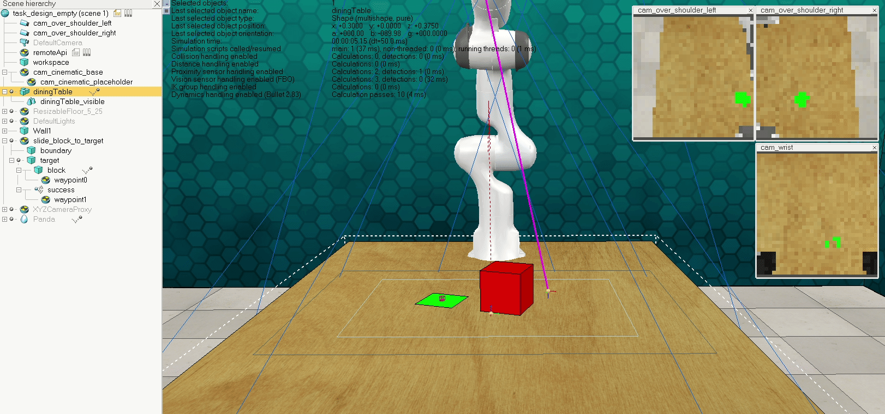

Note that creating a task involves (1) creating the task through the task builder, (2) creating the task by adding objects to the scene in a V-Rep simulator instance, then (3) coding the Python File and finally (4) passing the Task Validator. The last two steps are often an iterative process depending on the complexity of the task. (2) Will require first physical objects to be added, then normally sensors used to detect objects and thus define a succesful task completion, then waypoints used in calculating the Panda Robot's path and action in the simulator. (3) Involves creating handles to various objects and defining what counts as succesful task completion. (4) Must be passed for a task to be deemed a sufficient addition to this data set.

The design of a task must be given careful consideration. Ideally they would be tasks which one can imagine a Panda Arm Robot might one day be asked to do in real life; many tasks built thus far are common household ones such as hanging a picture frame on a wall peg or setting the dinner table, but tasks from construction, manufacturing and any general labour intensive sphere would also be seen as useful. Tasks also have varying levels of complexity and often have common themes tying them together; a good example would be open_cabinet and take_cup_out_from_cabinet. All that said, there really are no hard restrictions so use your creativity and imagination to see what you can create.


## Variations and their Episodes
At this point it is worth talking about episodes and variations. Every task has various textual descriptions asscosciated with them, to be used for linguistic learning in robotic tasks if desired. The picture below shows the various task descriptions returned from the init_episode() function in task *toilet_seat_up* for its single variation. Ideally these will between them include all possible ways of using the English language to describe a task; for example two of the various descriptions given for a particular episode of stack are 'stack the other cups on top of the red cup' and 'pick up and set the cups down into the red cup'. 

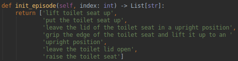

Every task has at least one variation, and every variation must have multiple episodes. *stack_cups* has multiple variations for each color of the base cup, for example another one of its variations could be described as 'stack the other cups on top of the blue cup'. Variations aren't restricted to varying colors either; setup_checkers has three episdoes, each instructing the Panda to setup the remaining 1, 2, or 3 checkers on the board. 

A *variation* is thus defined as a specific semantic meaning of the textual description of the task, such that different variations actually instruct the robot to do something slightly different on every variation. An *episode* is defined as a specific physical starting state (most likely layout/positioning) of the task objects for a particular variation, and these must differ between episodes across the same variation with the same semantic description. At minimum, the positioning/orientation of task objects must vary with episodes, but many tasks built so far vary object colors and sucess conditions (alongside Panda action instruction) with every change in episode.

## 1 Start the task builder
First off, simply run the task builder. A new V-Rep instance should automatically open, and this will run from the code found in the RLBench backend and Pyrep repos.

You will then be prompted to enter which task to edit. In this case, enter 'slide_block_to_target' as the task name, press enter, and enter 'y' to when asked to confirm if you want to create a new task. This will prompt the task builder to create both a python file in *rlbench/tasks* and a corresponding scene file with a .ttm extension in *rlbench/task_ttms*. Shown below is the task_buidler dialog for creating a new task called slide_block upon starting the task_builder.

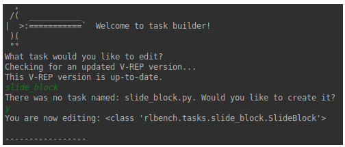

The ttm file should load automatically in the V-Rep instance, and this will contain the scene (a collection of walls, cameras, a table/workspace boundary, and the panda robot) and a task dummy which should in this case be named 'slide_block_to_target'. Shown below is the empty scene task_design_empty.ttt containing the empty task_dummy object named 'complex_task' for a task also named 'complex_task'.

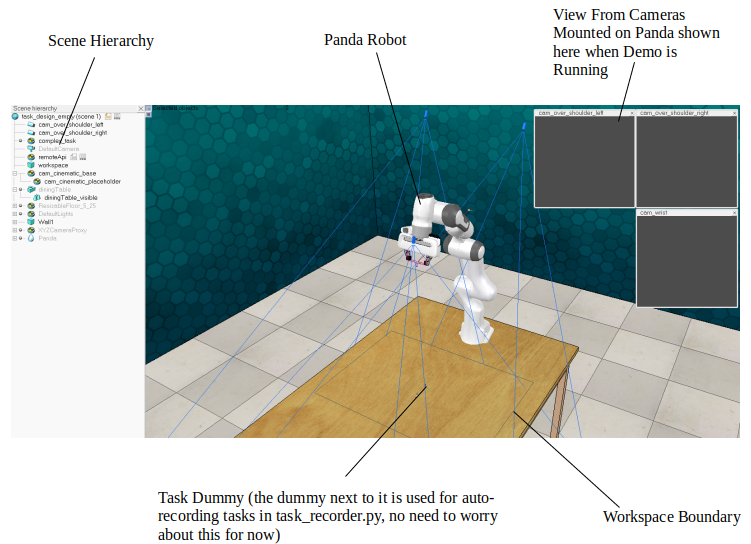

Notice in particular the Scene Hierarchy on the left, showing the parent child relationships for all existing objects in the scene, presented in a tree structure. Two things to note here: (1) Be aware that moving/rotating an object will do the same to its child objects, treating them as one single object for these particular operations and (2) it is important that any V-Rep objects created for the task must be made children of this task dummy, and that any objects that exist across tasks as part of the empty scene file (.ttt) are not included in the task dummy's downwards tree. This will ensure that when we save the task it is saved only to the task's scene file (.ttm), and that when we change between tasks everything is cleared away and loaded appropriately. To change the ordering within the scene hierarchy, simply hold down the mouse click and drag the object names up or down to the desired new parent and then release the mouse click.


## 2 Creating the Task in V-REP
To create a task, it must first be designed in the RLBench V-Rep instance. We will create the needed objects, making sure to set the dynamic and object special properties. For this task, a cube cube named 'block' was added along with a plane named 'target'. These objects need to placed on top of the table, within the 'workspace' boundary in order to make sure the panda can reach the objects and complete the task. 

Note first that in order to pan your view in the V-Rep instance you can make sure that the pan icon is selected in the upper left section of the screen (see picture below) then pan your view in a drag and drop fashion. To rotate your view angle, either hold down the scroller wheel button on your mouse if available, or select the icon directly to the right of the camera pan icon and move it in a drag and drop fashion. Spend a few seconds getting comfortable with this as creating a task will involve needing to view various positions from all sorts of angles.

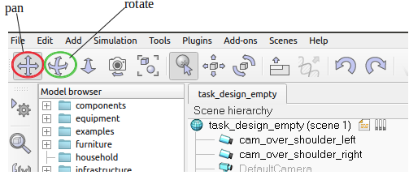

To create the block, go to the top toolbar and click on Add -> Primitive Shape -> Cuboid. You will then be prompted with a dialog where you can initialise the cuboid's properties:


For now let's ensure the cuboid dimensions are 0.1m along each edge, and click ok to create it. Notice that this cuboid is grey in color and is spawned on the floor underneath the table. Seeing as we will be setting the colour of the block dynamically from the Python file side there will be no need to do that just yet, but be aware that we would normally adjust the color of created objects as shown below. This is done by double clicking on the Cuboid in the V-Rep scene heirarchy to open the Scene Object Properties dialog, ensuring we are viewing the 'Shape' rather than 'Common' Properties, and clicking on either 'Adjust color' or 'Adjust texture'/'Quick textures (selection)'.

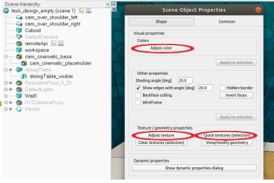

Once our cuboid has been created, we need to place it on top of the table. There are multiple ways to do this, here we will simply drag and drop it. In order to be able to to do this, we need to select the Translation/Position dialog by clicking on its icon in the upper left section of the V-Rep instance. We can select multiple ways of controlling an objects position; to select drag and drop click on the 'Mouse Translation' tab. From here we can select the axes along which to translate, selecting only 'along Z' as this will allow us to adjust its vertical position as shown in the figure below. By dragging it upwards we can place it on top of the table, noting that it is not a problem for there to be a (very) miniscule gap between the object and the table. To reduce the step size of the translation, initiate the translation by holding down the left mouse click, then keep the shift key pressed as this will allow you to place the object more precisely. Note also that to move objects along other axes or planes we can simply select the desired axes of translation as so, and that sometimes we want to move objects along axes relative to other objects if thieir bounding box has an awkward orientation (more on this in another tutorial).

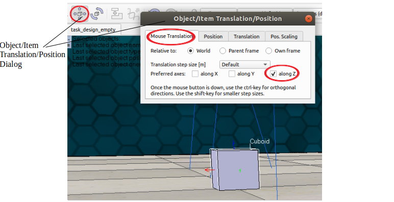

We finish creating the cuboid by setting its *Object Special Properties*. Double click on the cuboid in the Scene Hierarchy to open its Object Special Properties Dialog and open the *Common* tab. Under *Object special properties* set the object to *Collidable*, *Measurable*, *Detectable* and *Renderable* by checking their respective boxes:


*Collidable* means that the V-Rep simulator is able to detect a collision with other objects, and this is particular useful for path planning. *Measurable* enables minimum distance calculation between two objects and this we normally want to set this to enabled. *Detectable* enables detection of the object by proximity sensors; we will add one later in this task. Dinally *Renderable* means the object can be rendered by cameras and we also want this enabled for almost every object so that an object is visually present at training time.

Next we will create the target_visual. Create a plane by clicking on Add -> Primitive Shape -> Plane and create a plane with sides of length 0.1m. Set all four of its *Object special properties*. As we have done for the cuboid, drag and drop this onto the surface of the table, placing it next to the cuboid with roughly 0.1m of seperation. In this example, the cuboid is colored red and the plane is white, but you only need to worry about giving the plane a color so that it can be rendered as a surface and not just a hollow collection of edges, also known as a wireframe. At this point you should have something similar to the following picture:

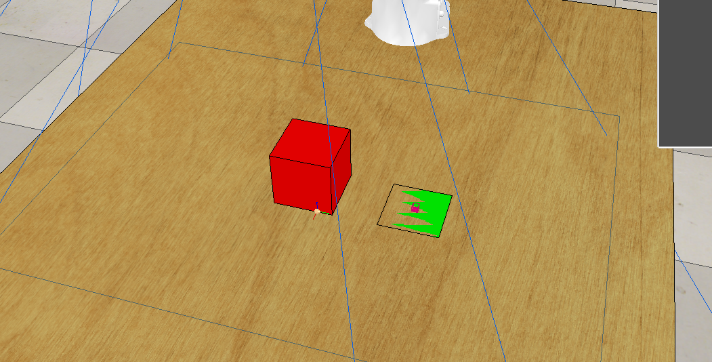

We colored in our plane white, but only parts of the plane appear colored from most viewpoints, the rest are not visible. You will notice that if the plane has the same vertical position as the surface of the table, it may or may not be wholly visible depending on the angle it is viewed from. For this reason, we will use the translation dialog to increase its z height by a miniscule amount. Open the Translation/Position dialog and go the 'Translation' tab. Enter *+1.00e-5* in the *Along Z* box and click on the *Z-translate sel.* button. Your plane should now be placed just above the surface of the table, and its colored surface visible from all direct viewpoints.

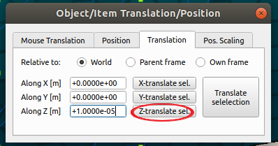

Now that we have the necessary physical objects placed appropriately in the scene, we need to add a proximity sensor. This will be needed to detect if the block has reached the target and will be used to define a succesful task completion later when writing the python file. Click on Add -> Proximity Sensor -> Pyramid Type. This will create a sensor with a detection volume far bigger than we need, so double click on the Proxity_sensor in the Scene Hierarchy to open its Scene Object Properties, click on *Show volume parameters* to open the Detection Volume Parameters dialog, and fill the fields in as shown below. This will drastically reduce the size like so:

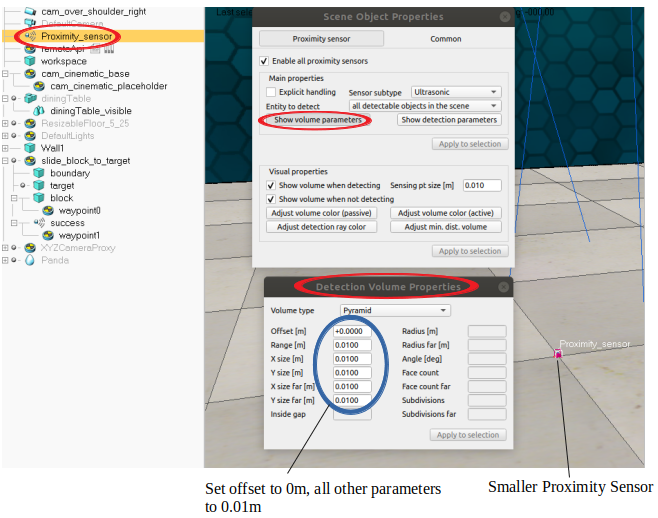

We want the task to slide the cuboid to the plane, as such we will place the proximity sensor at the centre of the plane. The easiest way to do this is to first make the sensor a child of the plane: drag and drop it onto the plane in the scene hierarchy, open the Translation/Position dialog, click on the *Position* tab, and then set its position relative to its parent frame to 0 along all axes like below. Rename this sensor to *success*.

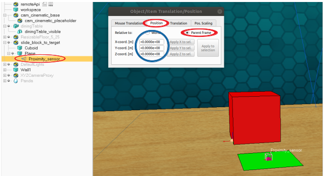

Next we need to deal with the physical properties of our objects. Both the block and the target have all Object Special Properties (Collidable, Measureable, Detectable, Renderable) set, and the block needs to be set to both respondable and dynamic within the dynamic properties log. *Respondable* means the object has a physical presence, ie that it exists for the purposes of physical interaction with other objects in the scene. *Dynamic* means external forces other than those applied to it by other forces can act on it, ie gravity and reactionary force. For both block, open its Scene object properties dialog, ensure the *Shape* tab is open, then click on *Show dynamic properties dialog*. This will open the Rigid Body Dynamic Properties dialog, check the boxes correspnding to *Body is respondable* and *Body is dynamic*.

Next, dummies named *waypoint0* and *waypoint1* need to be added. Dummies named in this way act as much needed waypoints in defining the intended motion and action of the panda gripper, and will be used by the path planning script in RlBench to determine what the panda does in simulation. The intended orientation of the dummies must be set appropriately, and in the next tutorial it will be seen that dummies can have extension_strings assosciated with them, instructing the gripper to do more complex things like grasping and ignoring collisions in path planning. Note that the panda gripper's motion and action will follow first waypoint0, then waypoint1 and so on in an ascending order.

To add such dummies, create them by clicking on Add -> Dummy. Make it a child of the Proximity Sensor and set its position relative it its parent frame to 0 along all axes, renaming this dummy as 'waypoint0' by double clicking on its name in the Scene Hierarchy, typing it, and and hitting enter. Add another Dummy and set it to a child of the cuboid, then open the Translation/Position dialog, set its relative position (to parent) to 0m in the X-coord and Z-coord boxes, but set the Y-coord box to -0.1m such that it is placed on the other side of the cuboid as the plane and proximity sensor. Name this 'waypoint1'.

At this point, we have a block sitting between 'waypoint0' and 'waypoint1', and hence Panda ends up planning a path that goes around the block. To avoid this, we must assign extension strings to 'waypoint1' by opening its Scene Object Properties dialog, select the Common tab at the top of the dialog, and typing in 'ignore_collisions()' in the Extension String text box found under General properties.
Finally we need to set the orientation of the waypoint dummys so that the panda has the easiest possible path to plan; this is because in simulation the panda will orient its gripper such that the dummy named 'Panda_tip' (which maintains constant pose relative to the Panda Tip) has an identical orientation to the waypoints it is reaching, and care must be taken to ensure that these waypoints have a feasible (ie reachable) pose. Open the Object/Item Rotatation/Orientation dialog by clicking on the icon just to the right of the Position/Translation dialog, go the the *Orientation* tab, and fill in its orientation (relative to the world) like so:

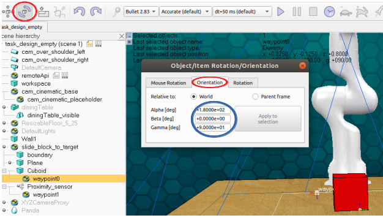

Finally, a plane named 'boundary' was created. This is defined to randomly spawn (move and rotate) the task objects within itself, and is needed for when we code the python file later. To create this we could simply add a plane of desired geometry and drag it onto the table surface, but there is an easier way. Select the workspace in the Scene hierarchy, do Ctrl+c then Ctrl+v to copy and paste it, then double click on the newly created workspace0 in the Scene Hierarchy to open its Scene Object Properties dialog. Click on *View/modify geometry* to open its geometry dialog, uncheck the *Keep proportions* box, and change the X and Y properties under *Scaling factors* to 0.70, keeping Z as 1.00. Click apply; this should leave you with a smaller *workspace0* inside than the workspace boundary, and take care to ensure that all objects which we have created are positioned within this new boundary.

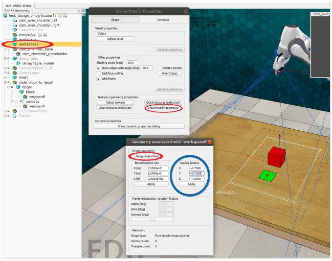

Remember to make *workspace0* a child of the slide_block_to_target task dummy by dragging and dropping it onto the task dummy within the scene hierarchy. Now we need to rename the shapes so that we can create handles with maximum readability for them later on in the Python file. Rename the Cuboid to *block*, the proximity sensor to *success*, workspace0 to *boundary* and the Plane to *target*. Finally, ensure all objects we created are children of the target plane, as later on when we define random spawning of the plane all child objects will be keep their pose relative to their parent constant. Ensure that your parent-child hierarchy is as so:

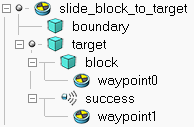

## 3 Writing the Python File
Now that we have created our simple scene file, we find and open *rlbench/tasks/slide_block_to_target.py*. This will contain empty functions as shown below, most of which must be defined at this point. 

```python
from typing import List
from rlbench.backend.task import Task


class ComplexTask(Task):

    def init_task(self) -> None:
        # TODO: This is called once when a task is initialised.
        pass

    def init_episode(self, index: int) -> List[str]:
        # TODO: This is called at the start of each episode.
        return ['']

    def variation_count(self) -> int:
        # TODO: The number of variations for this task.
        return 1

    def step(self) -> None:
        # Called during each sim step. Remove this if not using.
        pass

    def cleanup(self) -> None:
        # Called during at the end of each episode. Remove this if not using.
        pass
```

Explained, these are:

* **init_task()** - This is called whenever the simulator is started, and is called before any other functions contained in this file.
* **init_episode()** - This is called before the start of each indivual demo, it will automatically sample the task dummy and thus any children it has within the workspace whilst keeping the relative pose between all task objects we have created constant, but the rest is left up to the task creator.
* **variation_count()** - This must return the total number of variations, necessary for automating the running of this data set.
* **step()** - This is called at each time step in simulation, and can be used for altering the state of the scene once certain conditions have been met, for example the button in push_button changes color from red to green once succesfully pressed. This function is optional and should be deleted when not used.
* **cleanup()** - This is used to reset the state of the scene in between each run, it is called upon the completion of any succesful or unsuccesful demo. If your task alters the set of objects within the scene, ie by creating or deleting objects dynamically, the scene must be restored to its original state here. For example, in wipe_desk, the dirt spots dynamically created and spawned at the beggining of each demo must be deleted. This should also be deleted when not being used.

We first ensure that we import the necessary functions and classes from the pyrep and rlbench backend, the ones ones listed here are typical of most tasks and include standard classes Shape and Task, as well as classes interacting with the Spawn Boundary and Proximity Sensor, and finally a list defining colours in RGB format and a definition for the success condition to be used in this task:

```python
from typing import List
from pyrep.objects.shape import Shape
from pyrep.objects.proximity_sensor import ProximitySensor
from rlbench.const import colors
from rlbench.backend.task import Task
from rlbench.backend.conditions import DetectedCondition
from rlbench.backend.spawn_boundary import SpawnBoundary
```

### init_task() -> None:
Next we need to complete the functions instantiated in the SlideBlockToTarget task. The init_task() function will be called once when the simulator is started (by entering '+' in the task_builder dialog) and will need to contain our initialisation of various types of object handles, as well as the initialisation of success conditions that will remain constant throughout different episodes. Note that a demo of a task ends once all success conditions have been reached, these will include conditions on the state of the gripper (ie whether or not it is currently grapsing), as well as conditions on a particular proximity sensor detecting a particular object. More complex tasks will have success conditions varying and re-registering with each new episode and these will thus be dealt with inside the init_episode() function.

In order to instiate an object handle, simply create it using existing classes. Most objects, including boundary planes, will be a simple Shape, but other classes like spawn boundaries and proximity sensors will need to be created as such:

```python
self.block = Shape('block')
success_detector = ProximitySensor('success')
self.target = Shape('target')
self.boundary = SpawnBoundary([Shape('boundary')])
```

The last step to create init_task for this task will be to instatiate the success condition as a DetectedCondition() class, passing first the handle to the object to be detected and the intended proximity sensor, and then these success conditions will be registered, instructing the task_builder to stop and declare a succesful task once this condition has been reached. Notice that these conditions must be passed as a list, allowing multiple conditions to be ANDed together to define succesful task completion:

```python
success_condition = DetectedCondition(self.block, success_detector)
self.register_success_conditions([success_condition])
```

### init_episode(self, index: int) -> List[str]:
If the task is to have more than 1 variation, this function must first set *self._variation_index* for as below. Be aware for when creating your own tasks that this *index* variable is the only available information pertaining to which variation the task is currently set to perform. As such, any differences in your python script execution flow between variations must be dependent on this variable. This will, however, be illustrated in a more advanced tutorial so you do not need to worry about this for now. 

```python
self._variation_index = index
```

On calling a new episode, RLBench backend will randomly sample the task_dummy, along with all of its children, within the workspace boundary, keeping their relative positions and orientatations constant. In order to add more task variations to the dataset, we can cycle through the coloring of objects and textual descriptions (more on this later) of tasks by having these variations depend on the index. Here we cycle through block colours by choosing the desired colour from the pre-exisiting 'colors' list and calling .set_color on the block:

```python
block_color_name, block_rgb = colors[index]
self.block.set_color(block_rgb)
```

Next we clear our boundary and call .sample() on it in order to randomly move and rotate the task objects within it. Notice that only self.target needs to be passed in order to sample all task objects together whilst keeping their relative positions in tact, this is because all task objects (excluding the boundary) are children of self.target:

```python
self.boundary.clear()
self.boundary.sample(self.target)
```

We finish writing init_episode by defining its return. This must be a list of task descriptions written in english, to be used for semantic learning. Notice the *%s* string placeholder, this is done because the specific value of that string (aka the block color) will vary with every variation and is determined by the self.variation_index variable seen above. Make sure to return a list containing as many textual descriptions as you can think of, as this will massively aid this dataset's usefulness to robotic linguistic learning.

```python
return ['slide the %s block to target' % block_color_name,
        'push the %s cube to the white plane' % block_color_name,
        'nudge the %s block so that it covers the white target' % block_color_name,
        'Find the %s item on the table and manipulate its position so that it reaches the plane' % block_color_name]
```

### variation_count(self) -> int:
Finally, every task needs to have variation_count() defined. This must return the number of distinct task variations. In the case of slide_block_to_target, each variation will set the block colour to a different element from the colors list. As such, this function will simply return its length:


```python
return len(colors)
```
 
### Other class functions
Any other functions not being used, such as cleanup(), can be deleted in order to achieve a readable python file.

## 4 Playing around with the Task
Once the scene and python files have been created, it is time to test the task runs.  This can be done by entering '+' in the task builder dialog to run the simulator, then 'd' to test the demo of this particular variation. We are looking to make sure that the panda can reach most spawning positions across episodes and that the task works for all variations, this can be done by running demos for different episodes (press 'e' to cycle) and variations (press 'v') respectively. Common (but non-exhaustive) things to change at this point include changing the position/orientation/size of objects to make them reachable/graspable by the gripper, changing the position/orientation/size of any spawn boundaries to ensure most variations run smoothly, changing the min_rotation and max_rotation (through altering the .sample() parameters for any spawn boundary sampling and by redifining base_rotation_bounds() for workspace sampling on init_episode() calls), changing the dynamic properties (inc mass), and tinkering with the waypoint dummys to ensure a smooth and straightfoward path can be consistently planned.

## 5 Passing the Task Validator
To ensure a task has been made to completion, it must pass the task validator. This can be done by passing '!' to the task_builder dialog when not in simulation, and the task validator must deem the task succesful for demos it runs across every distinct variation. Most demos must be succesfully passed for the task validator to declare a succesful task. If your task does not pass this, go back to Step 4 and try again. If this still proves to be a major challenge, redesign and recreate the task in a simpler fashion.

## 6 What's Next?
You should now be able to understand how the simpler tasks in RlBench were created. More complicated tasks involve more complex code, for example in changing the position of waypoints dynamically whilst a demo is running, spawning and then deleting objects dynamically, changing object properties such as colour within the task etc. Once you have understood how this task was created,  work your way through the next tutorial on creating a more complex task to familiarise yourself with how these problems have been solved in examples created so far.
